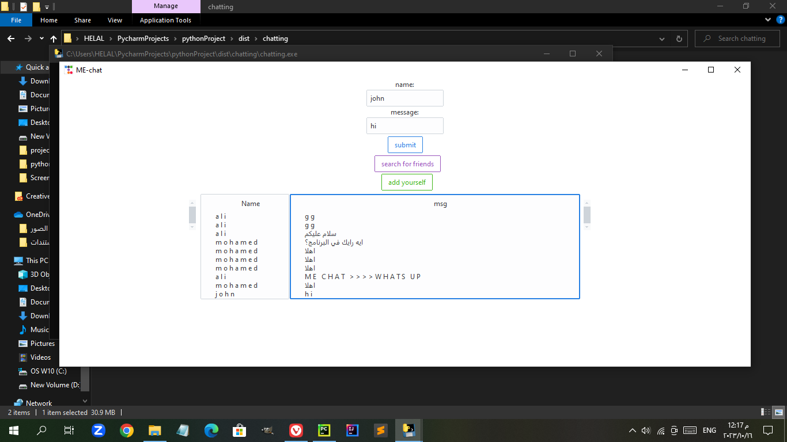

# ME-chat

a python program for chatting and searching for friends 
Simply,program is connected with online database every 2 seconds program fetch messages to make user see all new messages fastly ,
-You can send/receive messages ,You can search for friends
-If someone submits himself in program and you searched about same hobby he has submitted he will appear to you
-You can add yourself in program (name,hobby,age,fav qoute,facebook,etc)
-Then you will appear in searching for friends section if someone searched for hobby you have just inserted!
I wish app has been liked by you all
-Thanks
-Hamoda Emary

